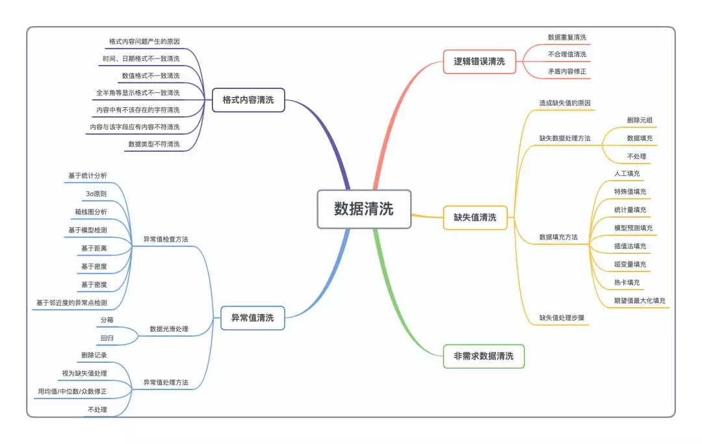

## Summary
 
数据和特征决定了机器学习的上限，而模型和算法只是逼近这个上限而已。由此可见，特征工程在机器学习中占有相当重要的地位。在实际应用当中，可以说特征工程是机器学习成功的关键。

### 什么是特征工程
 
特征工程又包含了Data PreProcessing（数据预处理）、Feature Extraction（特征提取）、Feature Selection（特征选择）和Feature construction（特征构造）等子问题，本章内容主要讨论数据预处理的方法及实现。
 
特征工程是机器学习中最重要的起始步骤，数据预处理是特征工程的最重要的起始步骤，而数据清洗是数据预处理的重要组成部分，会直接影响机器学习的效果。    

### 数据清洗介绍

